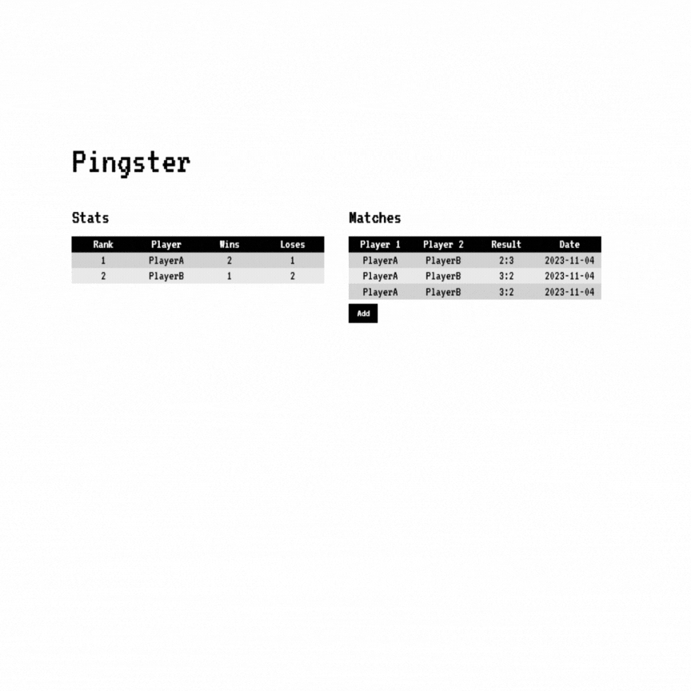

# Pingster
Pingster is a web application for managing and viewing your
 ping pong league. The project consists of a frontend built with React and a backend built with Express.js, connected to a MongoDB database.

    

## Prerequisites

- [Node.js](https://nodejs.org/)
- [Docker](https://www.docker.com/)
- [Docker Compose](https://docs.docker.com/compose/)